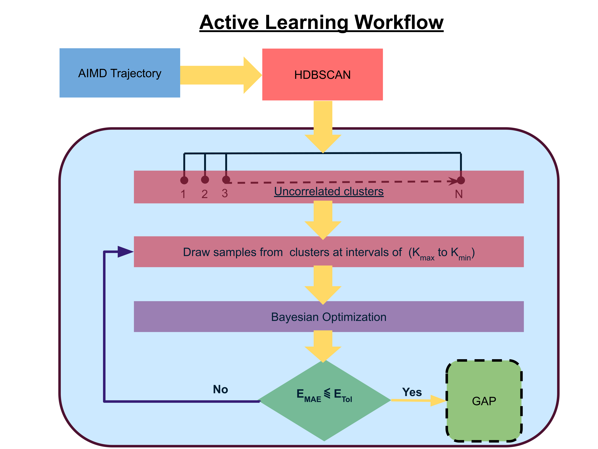

## Active learning workflow for Gaussian Approximation Potential (GAP)

Documentation for the active learning workflow developed as a part of the article "Machine Learning Inter-Atomic Potentials Generation Driven by Active Learning: 
A Case Study for Amorphous and Liquid Hafnium dioxide". 
__For more details, please refer to the [paper](https://www.nature.com/articles/s41524-020-00367-7).__

If you are using this active learning workflow  in your research paper, please cite us as
```
@article{sivaraman2020machine,
  title={Machine-learned interatomic potentials by active learning: amorphous and liquid hafnium dioxide},
  author={Sivaraman, Ganesh and Krishnamoorthy, Anand Narayanan and Baur, Matthias and Holm, Christian and Stan, Marius and Cs{\'a}nyi, G{\'a}bor and Benmore, Chris and V{\'a}zquez-Mayagoitia, {\'A}lvaro},
  journal={npj Computational Materials},
  volume={6},
  number={1},
  pages={1--8},
  year={2020},
  publisher={Nature Publishing Group}
}
```




First to clone the github and then replicate a new anaconda environment using the **environment.yml** file:

```
git clone https://github.com/argonne-lcf/active-learning-md
cd active-learning-md
conda env create -f environment.yml
```

As the title suggests the active learning is implemented to automate the training for the GAP model. Please refer to the 
[QUIP software library online documentation](http://libatoms.github.io/QUIP/) for more details. Once the QUIP libraries has been compiled, please set the 
flag below in your HPC submission script, which should point to the full path to the `teach_sparse` and `quip` binaries. The workflow script described in 
the next section will automatically invoke the required binaries if this flag is set correctly. 

```
export QUIP_PATH=/path/libatoms/QUIP-git/build/linux_x86_64_ifort_icc_openmp/
```

**Note: As one can see the version of QUIP used in this study is compiled with OpenMP support and can fully exploit node level parallelization!**


## The workflow script

Let us go through the workflow script. The workflow is implemented through the script 'BayesOpt_SOAP.py'. The 
functionality of this script can be seen below. 

```
$ python BayesOpt_SOAP.py --help 

usage: BayesOpt_SOAP.py [-h] -xyz XYZFILENAME [-Ns] [-Nm] -c CUTOFF
                        [CUTOFF ...] -s NSPARSE [NSPARSE ...] -nl NLMAX
                        [NLMAX ...] -Nbo NOPT [NOPT ...]

A python workflow to run active learning for GAP

optional arguments:
  -h, --help            show this help message and exit
  -xyz XYZFILENAME, --xyzfilename XYZFILENAME
                        Trajectory filename (xyz formated)
  -Ns , --nsample       Minimum sample size
  -Nm , --nminclust     No of Minimum clusters. Tweak to reduce noise points
  -c CUTOFF [CUTOFF ...], --cutoff CUTOFF [CUTOFF ...]
                        Cutt off range for SOAP. Usage: '-c min max'.
                        Additional dependency: common sense!
  -s NSPARSE [NSPARSE ...], --nsparse NSPARSE [NSPARSE ...]
                        Nsparse for SOAP. Usage: '-s min max'. Additional
                        dependency: common sense
  -nl NLMAX [NLMAX ...], --nlmax NLMAX [NLMAX ...]
                        Nmax, Lmax range. Usage: '-nl min max'. Additional
                        dependency: common sense!
  -Nbo NOPT [NOPT ...], --Nopt NOPT [NOPT ...]
                        Number of exploration and optimization steps for BO.
                        e.g.'-Nbo 25 50'

```


**Warning: Do not run this on your desktop. Try to get a HPC allocation and run it there!**

# How to run the workflow  ? 

Extract the trajectory from the `data` folder.

```
python -u  BayesOpt_SOAP.py  -xyz  a-Hfo2-300K-NVT.extxyz  -Ns 10 -Nm 10 -c 4 6 -s 100 1200 -nl 3 8 -Nbo 10 20  > BO-SOAP.out

```

In our benchmarks, our workflow  converged in  N<sub>iter</sub> = 2 with a  total run time of  `1080 s` on a single node (Intel Broadwell). The optimal training and validation configurations 
are  written to `opt_train.extxyz` and `opt_train.extxyz` respectively. The detailed output is written to `activelearned_quipconfigs.json`. 


## Acknowledgements
This material is based upon work supported by Laboratory Directed Research and Development (LDRD) funding from Argonne National Laboratory,
provided by the Director, Office of Science, of the U.S. Department of Energy under Contract No. DE-AC02-06CH11357. This research used resources of the
Argonne Leadership Computing Facility, which is a DOE Office of Science User Facility sup-ported under Contract DE-AC02-06CH11357.
Argonne National Laboratory's work was supported by the U.S. Department of Energy, Office of Science, under contract DE-AC02-06CH11357. We gratefully acknowledge the computing resources provided on Bebop; 
a high-performance computing cluster operated by the Laboratory Computing Resource Center at Argonne National Laboratory. This research used resources of
the Advanced Photon Source, a U.S. Department of Energy (DOE) Office of Science User Facility operated for the DOE Office of Science by Argonne National Laboratory 
under Contract No. DE-AC02-06CH11357. Use of the Center for Nanoscale Materials, an Office of Science user facility, was supported by the U.S. Department of Energy,
Office of Science, Office of Basic Energy Sciences, under Contract No. DE-AC02-06CH11357. 


